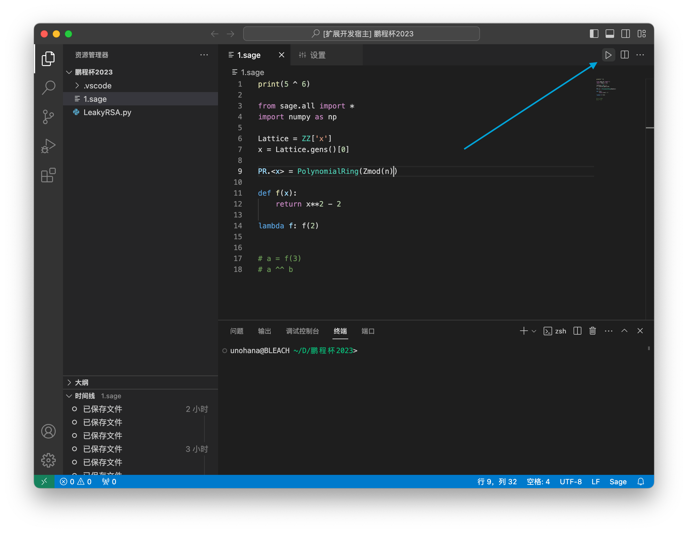

  

<h1 align="center">SageMath Enhanced for VS Code</h1>

  
  
  
  
  
  
  
  

  <a href="README.md">English</a> | <a href="README.zh.md">中文</a>

Enhance your SageMath coding experience in Visual Studio Code with the SageMath Enhanced extension. This extension provides advanced features and integrations, making it easier and more efficient to work with SageMath in VS Code.

## Features

- **Language Server Protocol (LSP) Support**: Complete LSP implementation providing advanced language features
- **Intelligent Code Completion**: Context-aware autocompletion for SageMath functions, classes, and methods
- **Hover Documentation**: Instant documentation and type information on hover
- **Syntax Highlighting**: Comprehensive syntax highlighting for SageMath-specific constructs including:
  - Ring and field declarations (ZZ, QQ, RR, CC, GF, etc.)
  - Polynomial rings and generators
  - Mathematical functions and operators
  - Linear algebra operations
  - Plotting and visualization functions
  - Number theory and combinatorics functions
  - Cryptographic functions
  - Graph theory constructs
- **Code Snippets**: Pre-built code snippets for common SageMath patterns
- **Enhanced Language Configuration**: Improved indentation, bracket matching, and auto-closing pairs
- **Script Execution**: Run SageMath files directly from the editor
- **Automatic Cleanup**: Optional removal of generated `.sage.py` files
- **WSL Support**: Enhanced Windows Subsystem for Linux compatibility
- **Diagnostics**: Real-time error detection and syntax validation
- **Server Management**: Restart language server command for troubleshooting

 *The Run SageMath File button (shown above), demo video below*

https://github.com/n-WN/sagemath-vscode-enhanced/assets/30841158/2a8d5cea-8c21-4886-8e18-b48893691fe4

## Quick Start

1. **Installation**: Install the SageMath Enhanced extension from the VS Code Marketplace.
2. **Opening Sage Files**: Open any `.sage` file or create a new one in VS Code.
3. **Running Code**: Use the command palette (`Ctrl+Shift+P` / `Cmd+Shift+P`) and type `Run SageMath File` to execute your script.
4. **Viewing Output**: Check the integrated terminal for your script's output and any error messages.

## Installation

Follow these steps to install the SageMath Enhanced extension:

1. Launch VS Code.
2. Press `Ctrl+P` (`Cmd+P` on macOS) to open the Quick Open dialog.
3. Type `ext install sagemath-enhanced` and press Enter.
4. Find the SageMath Enhanced extension in the search results and click the `Install` button.

## Usage

Using the SageMath Enhanced extension is simple and intuitive, providing a seamless experience for SageMath coding within VS Code.

### Language Server Features

The extension now includes a full Language Server Protocol implementation providing:

- **Code Completion**: Press `Ctrl+Space` (or `Cmd+Space` on macOS) to trigger intelligent autocompletion
- **Hover Information**: Hover over SageMath functions to see documentation
- **Snippet Support**: Type snippet prefixes like `var`, `matrix`, `plot` and press Tab to expand
- **Real-time Diagnostics**: Get immediate feedback on syntax errors

### Opening and Running SageMath Files

1. **Opening a Sage File**: Open your `.sage` file in VS Code, or create a new one by selecting `File > New File` and saving it with the `.sage` extension.
2. **Running the Code**: Once a `.sage` file is open in the editor, you'll notice a **Run SageMath File** button (play icon) in the editor's title bar. Clicking this button will execute the SageMath code in the currently active `.sage` file.
3. **Automatic Cleanup**: If enabled in the extension settings, the temporary `.sage.py` file generated during execution will be automatically deleted after the script finishes running.
4. **WSL Support**: If you're on Windows and have WSL installed, the extension can run SageMath scripts inside WSL for enhanced compatibility.

### Language Server Management

- **Restart Server**: Use the Command Palette (`Ctrl+Shift+P`) and search for "Restart SageMath Language Server" if you encounter any language server issues.

### Available Code Snippets

The extension includes numerous code snippets for common SageMath patterns:

- `var` - Create symbolic variables
- `matrix` - Create matrices
- `plot` - Plot functions
- `solve` - Solve equations
- `factor` - Factor expressions
- `integrate` - Compute integrals
- `diff` - Take derivatives
- And many more...

### Viewing Output

- **Integrated Terminal**: The output from your SageMath script, along with any errors or warnings, will be displayed in VS Code's integrated terminal. This allows for easy debugging and interaction with your code.

## Configuration

The extension provides several configuration options to customize your SageMath development experience:

### Basic Settings

- `sagemathEnhanced.interpreterPath`: Path to the SageMath interpreter (default: "sage")
- `sagemathEnhanced.autoDeleteGeneratedFile`: Automatically delete generated .sage.py files (default: false)
- `sagemathEnhanced.useWSL`: Use Windows Subsystem for Linux (default: false)

### Language Server Settings

- `sagemathEnhanced.enableDiagnostics`: Enable diagnostic messages and error checking (default: true)
- `sagemathEnhanced.enableCompletion`: Enable code completion and IntelliSense (default: true)
- `sagemathEnhanced.enableHover`: Enable hover documentation (default: true)
- `sagemathEnhanced.maxNumberOfProblems`: Maximum number of diagnostic problems shown (default: 100)
- `sagemathEnhanced.logLevel`: Language server log level (default: "info")

You can configure these settings in your VS Code settings (File > Preferences > Settings) by searching for "SageMath Enhanced".

## Requirements

- [Visual Studio Code](https://code.visualstudio.com/) version 1.76.0 or higher.
- [SageMath](http://www.sagemath.org/) installed and accessible from the command line.

## Contributing

We welcome contributions to the SageMath Enhanced extension. Here's how you can contribute:

1. Fork the repository on GitHub. You can find the repository at [sagemath-vscode-enhanced](https://github.com/n-WN/sagemath-vscode-enhanced).
2. Create a new branch for your feature (`git checkout -b feature/YourFeature`).
3. Commit your changes (`git commit -am 'Add some YourFeature'`).
4. Push to the branch (`git push origin feature/YourFeature`).
5. Create a new Pull Request on GitHub against the `sagemath-vscode-enhanced` repository.

## Support and Feedback

If you encounter any issues or have suggestions for improvements, please file an issue on the [GitHub repository](https://github.com/n-WN/sagemath-vscode-enhanced/issues).

## License

This project is licensed under the AGPL-3.0 License - see the [LICENSE](LICENSE) file for details.

## TODO (Also Known As "Need Help")

- [x] **Code Completion**: Enhanced code completion for SageMath-specific syntax implemented via LSP.
- [x] **Syntax Highlighting**: Comprehensive syntax highlighting for SageMath operations and functions.
- [x] **Error Highlighting**: Real-time diagnostic feedback on syntax errors and computational exceptions.
- [x] **Language Server Protocol**: Full LSP implementation with hover, completion, and diagnostics.
- [x] **Code Snippets**: Pre-built snippets for common SageMath patterns.
- [ ] **Interactive Plots**: Enable rendering of interactive SageMath plots within VS Code.
- [ ] **Documentation Integration**: Enhanced hover tooltips with comprehensive SageMath documentation.
- [ ] **Performance Optimization**: Further improve startup time and responsiveness of the extension.
- [ ] **Advanced Diagnostics**: Deep integration with SageMath for semantic error checking.
- [ ] **Refactoring Support**: Code refactoring capabilities for SageMath symbols.
- [ ] **Debugging Support**: Step-through debugging for SageMath scripts.
- [ ] **Notebook Integration**: Support for SageMath notebooks (.ipynb with SageMath kernel).

The extension now provides a solid foundation with proper LSP architecture. Future enhancements will focus on deeper SageMath integration and advanced IDE features.

<!-- For the issues with indentation and autocomplete, if they cannot be resolved through simple configuration changes, it might indeed necessitate the assistance of a more sophisticated language server (such as implementing a Language Server Protocol server specifically for SageMath) to provide advanced support similar to what Pylance does for Python. This could involve a significant development effort, including a deep understanding of SageMath syntax and features, as well as integration with VS Code's language server APIs. -->

## Acknowledgements

- Special thanks to the [SageMath](http://www.sagemath.org/) community for their invaluable resources and support.
